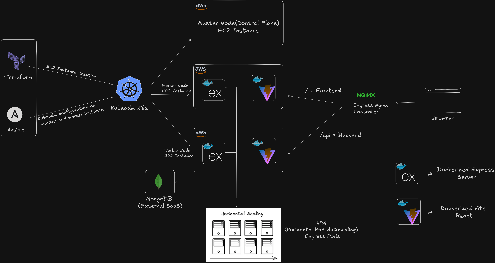

<p align="center">
  
</p>

<h1 align="center">⚡ Flow — Visual Workflow Automation Engine</h1>

<p align="center">
  <b>Build, connect, and execute multi-service automation workflows with a visual drag-and-drop canvas</b>
</p>

<p align="center">
  
  
  
  
  
  
  
  
</p>

<p align="center">
  <a href="#-demo"><b>📺 Watch Demo</b></a> •
  <a href="#-features"><b>Features</b></a> •
  <a href="#-architecture"><b>Architecture</b></a> •
  <a href="#-tech-stack"><b>Tech Stack</b></a> •
  <a href="#-getting-started"><b>Quick Start</b></a> •
  <a href="#-deployment"><b>Deployment</b></a>
</p>

---

## 📺 Demo

> 🎬 **Video Walkthrough** — [Watch on YouTube / Google Drive](YOUR_VIDEO_LINK_HERE)
>


---

---

## Project Photos

<p align="center">
  
    
</p>

---


## Architecture Diagram

<p align="center">
  
</p>

---

## 📖 Overview

**Flow** is a full-stack, production-ready workflow automation platform inspired by tools like Zapier and n8n — but designed from scratch with a modern stack and self-hosted infrastructure.

Users visually construct automation pipelines by dragging service nodes onto a React Flow canvas, connecting them with edges, and executing the entire workflow with a single click. The backend traverses the workflow graph (BFS), executes each node sequentially, passes data between steps through a **Universal Data Envelope**, and returns per-node results to the frontend in real time.

### What makes Flow different?

| Capability | Description |
|:---|:---|
| **Visual DAG Builder** | Drag-and-drop canvas powered by React Flow with dynamic node rendering, resizing, minimap, and directional edge arrows |
| **10+ Service Integrations** | Gmail, Google Docs, Sheets, Drive, Forms, Meet, Notion, Discord, Gemini AI — all with full OAuth2 token management |
| **Graph Execution Engine** | BFS-based workflow runner with expression interpolation (`{{node_1.data}}`), conditional routing, and JS/AI data transformation |
| **Per-Node Testing** | Test any node individually |
| **Variable Picker** | Inline `{{variable}}` insertion from upstream node outputs — no manual path memorization |
| **Full DevOps Pipeline** | Docker → Terraform → Ansible → Kubernetes (self-managed on AWS EC2) with HPA autoscaling |

---

## ✨ Features

### 🎨 Frontend — Interactive Canvas

- **Drag & Drop Nodes** from a categorized sidebar with service icons
- **Dynamic Node Rendering** — each node auto-fetches its schema (inputs, accounts, options) from the backend
- **Node Detail Panel** — right-side inspector for configuring inputs, selecting OAuth accounts, and viewing test/pipeline outputs
- **Variable Picker** — click to insert `{{upstream_node_id.field}}` references into any input field
- **Router Node** — conditional branching with custom rules (e.g., `{{node_1.score}} > 50`) and fallback paths
- **Workflow Management** — save, load, update, create new workflows with UUID-based IDs
- **OAuth Account Management** — connect and manage multiple Google, Notion, and Discord accounts via a modal UI
- **Waitlist Landing Page** — email-gated early access with automatic redirect for authenticated users
- **Google OAuth Login** — single-click sign-in via Google

### ⚙️ Backend — Execution Engine

- **Node Registry Pattern** — every service (Gmail, Sheets, Notion, etc.) is a self-contained module with `execute()`, `inputs`, `ui`, and optional `getToken()` methods
- **BFS Graph Traversal** — auto-detects starting nodes (no incoming edges), traverses connected nodes, and halts gracefully on failure
- **Expression Engine** — `{{node_id.path.to.field}}` interpolation with recursive evaluation of nested inputs
- **JS Sandbox** — sandboxed JavaScript execution via `vm` module for the Data Transformer node
- **AI Transformer** — use natural language instructions to transform data (powered by Gemini 2.5)
- **Conditional Router** — evaluates expressions at runtime and routes to matching edge handles
- **OAuth2 Token Refresh** — automatic token refresh for Google, Notion, and Discord connections
- **Multi-Account Support** — users can connect multiple accounts per service (e.g., 3 Gmail accounts)
- **JWT Authentication** — secure API routes with 30-day expiry tokens

### 🔌 Supported Integrations

| Service | Operations |
|:---|:---|
| **Gmail** | Send Message, Get Thread, List Threads |
| **Google Docs** | Create Document, Append Document, Get Document |
| **Google Drive** | List Files |
| **Google Forms** | Create Form, Add Question, Get Details, List Responses |
| **Google Meet** | Create Space, Get Space, List Recordings, List Transcripts |
| **Google Sheets** | Create Spreadsheet, Append Row/Column, Get Rows/Column, Get Info |
| **Notion** | Search, Create Page/Database/Database Item, Append Block, Get/Query Database, Get Page/Content |
| **Discord** | Get Guilds, Get Channels, Send Message, Get Connections |
| **Gemini AI** | Generate Text (Gemini 2.5 Flash / 2.5 Pro) |
| **Core — Manual Input** | Start workflow with custom text or JSON data |
| **Core — Data Transformer** | JavaScript sandbox or AI-powered data manipulation |

---

## 🏗 Architecture

```
┌──────────────────────────────────────────────────────────────────────────┐
│                          USER BROWSER                                    │
│                                                                          │
│  ┌─────────────┐   ┌─────────────────────┐   ┌─────────────────────┐    │
│  │   Sidebar    │   │    React Flow       │   │  Node Detail Panel  │    │
│  │  (Services)  │──▶│    Canvas (DAG)     │◀──│  (Config/Test/Out)  │    │
│  └─────────────┘   └──────────┬──────────┘   └─────────────────────┘    │
│                                │                                         │
│  ┌─────────────┐   ┌──────────▼──────────┐   ┌─────────────────────┐    │
│  │  Waitlist /  │   │      Topbar         │   │    Modals           │    │
│  │  Login Page  │   │ (Run/Save/Browse)   │   │ (OAuth/Save/Profile)│    │
│  └─────────────┘   └──────────┬──────────┘   └─────────────────────┘    │
│                                │                                         │
│         Zustand Stores: canvasStore, userStore, workflowStore,           │
│                          oAuthStore, nodeTestStore, jwtTokenStore        │
└────────────────────────────────┼─────────────────────────────────────────┘
                                 │ REST API (JWT Auth)
                                 ▼
┌──────────────────────────────────────────────────────────────────────────┐
│                          EXPRESS.JS SERVER                               │
│                                                                          │
│  ┌────────────────────────── API Routes ──────────────────────────────┐  │
│  │  /api/profile   /api/auth   /api/node_test   /api/workflow        │  │
│  │                              /api/waitlist                         │  │
│  └───────────────────────────────┬────────────────────────────────────┘  │
│                                  │                                       │
│  ┌──────────────┐  ┌─────────────▼──────────────┐  ┌──────────────────┐ │
│  │  Auth        │  │   Workflow Engine           │  │   Node Registry  │ │
│  │  Middleware   │  │                             │  │                  │ │
│  │  (JWT)       │  │  ┌─ BFS Graph Traversal  ─┐ │  │  gmail_node.ts   │ │
│  └──────────────┘  │  │  Expression Engine     │ │  │  discord.ts      │ │
│                     │  │  Router Evaluator      │ │  │  notion.ts       │ │
│  ┌──────────────┐  │  │  JS Sandbox (vm)       │ │  │  googleSheets.ts │ │
│  │  OAuth2      │  │  │  AI Transformer        │ │  │  googleDocs.ts   │ │
│  │  Controller  │  │  └─────────────────────────┘ │  │  googleDrive.ts  │ │
│  │  + Callbacks │  │  Universal Data Envelope:    │  │  googleForms.ts  │ │
│  └──────────────┘  │  { nodeId: output, ... }     │  │  googleMeet.ts   │ │
│                     └─────────────────────────────┘  │  gemini.ts       │ │
│  ┌──────────────┐                                    │  general_node.ts │ │
│  │  Token       │                                    └──────────────────┘ │
│  │  Refresh     │                                                        │
│  │  Utility     │                                                        │
│  └──────────────┘                                                        │
└──────────────────────────────────┬───────────────────────────────────────┘
                                   │
                                   ▼
┌──────────────────────────────────────────────────────────────────────────┐
│                         MONGODB (Mongoose)                               │
│                                                                          │
│   ┌──────────┐  ┌─────────────────┐  ┌──────────────────────────────┐   │
│   │  Users   │  │  Workflows      │  │  OAuth Connections           │   │
│   │          │  │  (DAG + Nodes   │  │  ┌─ GoogleConnection         │   │
│   │  email   │  │   + Edges)      │  │  ├─ NotionConnection         │   │
│   │  name    │  │                 │  │  └─ DiscordConnection         │   │
│   │  conns[] │  │  workflowId     │  │                              │   │
│   └──────────┘  │  nodes (Map)    │  │  access_token, refresh_token │   │
│                 │  edges []       │  │  scope, identifiers          │   │
│                 └─────────────────┘  └──────────────────────────────┘   │
└──────────────────────────────────────────────────────────────────────────┘
```


---

## 🛠 Tech Stack

### Frontend

| Technology | Purpose |
|:---|:---|
| **React 19** | UI framework |
| **TypeScript** | Type safety |
| **Vite 8** | Build tool & dev server |
| **React Flow (xyflow)** | Visual DAG canvas |
| **Zustand** | Lightweight state management |
| **Tailwind CSS 4** | Utility-first styling |
| **React Router DOM 7** | Client-side routing |
| **Lucide React** | Icon library |

### Backend

| Technology | Purpose |
|:---|:---|
| **Node.js 24** | Runtime |
| **Express 5** | HTTP framework |
| **TypeScript** | Type safety |
| **Mongoose / MongoDB** | ODM & database |
| **JSON Web Tokens** | Authentication |
| **Zod** | Request validation |
|

### DevOps & Infrastructure

| Technology | Purpose |
|:---|:---|
| **Docker** | Containerization (multi-stage builds) |
| **Docker Compose** | Local multi-service orchestration |
| **Terraform** | AWS EC2 + VPC + Security Group provisioning |
| **Ansible** | Kubernetes cluster bootstrap (kubeadm) |
| **Kubernetes** | Container orchestration with HPA autoscaling |
| **Nginx** | Frontend static file serving & reverse proxy |
| **Nginx Ingress** | K8s path-based routing (`/api` → backend, `/` → frontend) |

---

## 🚀 Getting Started

### Prerequisites

- **Node.js** ≥ 24.x
- **pnpm** (for backend) / **npm** (for frontend)
- **MongoDB** instance (local or Atlas)
- **Google Cloud Console** project with OAuth2 credentials
- _(Optional)_ Docker & Docker Compose

### 1. Clone the Repository

```bash
git clone https://github.com/AAshu1412/flow.git
cd flow
```

### 2. Backend Setup

```bash
cd server

# Install dependencies
pnpm install

# Configure environment variables
cp .env.example .env
```

Edit `server/.env` with your credentials:

```env
# Database
MONGODB_URL=mongodb://localhost:27017/flow

# Authentication
JWT_SECRET_KEY=your_secure_random_secret_key

# Google OAuth2
GOOGLE_CLIENT_ID=your_google_client_id
GOOGLE_CLIENT_SECRET=your_google_client_secret
GOOGLE_REDIRECT_URI=http://localhost:5001/api/auth/google/callback

# Notion OAuth2
NOTION_CLIENT_ID=your_notion_client_id
NOTION_CLIENT_SECRET=your_notion_client_secret
NOTION_REDIRECT_URI=http://localhost:5001/api/auth/notion/callback

# Discord OAuth2
DISCORD_CLIENT_ID=your_discord_client_id
DISCORD_CLIENT_SECRET=your_discord_client_secret
DISCORD_REDIRECT_URI=http://localhost:5001/api/auth/discord/callback

# Gemini AI
GEMINI_API_KEY=your_gemini_api_key

# Frontend URL (for CORS)
FRONTEND_URL=http://localhost:5173
```

```bash
# Start development server
pnpm run dev
# Server runs on http://localhost:5001
```

### 3. Frontend Setup

```bash
cd frontend

# Install dependencies
npm install

# Configure environment
echo "VITE_SERVER_URL=http://localhost:5001" > .env
```

```bash
# Start development server
npm run dev
# App runs on http://localhost:5173
```

### 4. Docker Compose (Full Stack)

```bash
# From the project root
docker compose up --build
# Frontend: http://localhost:80
# Backend:  http://localhost:5001
```

---

## ☁️ Deployment

Flow includes a complete **Infrastructure as Code (IaC)** pipeline for self-hosted deployment on AWS.

### Infrastructure Pipeline

```
Terraform (Provision)  →  Ansible (Configure)  →  Kubernetes (Orchestrate)
     AWS EC2                k8s cluster              Deployments + HPA
     VPC/SG                 kubeadm init             Ingress routing
     Key Pairs              containerd               Secrets management
```

### Terraform — Provision AWS EC2

```bash
cd terra
terraform init
terraform plan
terraform apply
```

Provisions:
- EC2 instances (Ubuntu) with Docker pre-installed
- Security Group with ports for SSH, HTTP, HTTPS, K8s API, Backend, MongoDB
- Ed25519 SSH key pair

### Ansible — Bootstrap Kubernetes

```bash
cd ansible
# 1. Install containerd, kubeadm, kubelet, kubectl on all nodes
ansible-playbook -i hosts.txt 1-k8s-common-install.yml

# 2. Initialize master node
ansible-playbook -i hosts.txt 2-k8s-master-config.yml

# 3. Join worker nodes
ansible-playbook -i hosts.txt 3-k8s-worker-config.yml

# 4. Install Nginx Ingress Controller
ansible-playbook -i hosts.txt 4-k8s-ingress.yml
```

### Kubernetes — Deploy Application

```bash
cd k8s/raw_k8s

# Create namespace
kubectl apply -f namespace.yaml

# Deploy backend (2 replicas + HPA autoscaling 1–5 pods)
kubectl apply -f backend/

# Deploy frontend
kubectl apply -f frontend/

# Configure ingress routing
kubectl apply -f ingress.yaml
```

**K8s Architecture:**
- Backend: 2 replica pods → HPA scales 1–5 based on 70% CPU threshold
- Frontend: Nginx-served static SPA
- Ingress: `/api/*` → backend service `:5001`, `/*` → frontend service `:80`
- Secrets: Environment variables injected via K8s Secrets

---

## 📂 Project Structure

```
flow/
├── frontend/                      # React + Vite SPA
│   ├── src/
│   │   ├── components/
│   │   │   ├── FlowCanvas.tsx     # React Flow canvas (drag/drop, edges)
│   │   │   ├── DynamicNode.tsx    # Universal node renderer
│   │   │   ├── Sidebar.tsx        # Service integration browser
│   │   │   ├── Topbar.tsx         # Run / Save / Browse / Profile
│   │   │   ├── NodeDetailPanel.tsx# Right-side config inspector
│   │   │   ├── VariablePicker.tsx # {{variable}} insertion UI
│   │   │   ├── AccountsModal.tsx  # OAuth account management
│   │   │   ├── SaveWorkflowModal.tsx
│   │   │   ├── SavedWorkflowsModal.tsx
│   │   │   └── UserProfileModal.tsx
│   │   ├── pages/
│   │   │   ├── Dashboard.tsx      # Main canvas workspace
│   │   │   ├── Login.tsx          # Google OAuth login
│   │   │   ├── Waitlist.tsx       # Email-gated landing page
│   │   │   └── AuthSuccess.tsx    # OAuth callback handler
│   │   ├── store/                 # Zustand state stores
│   │   └── types/                 # TypeScript type definitions
│   ├── Dockerfile                 # Multi-stage: Node build → Nginx serve
│   └── nginx.conf                 # SPA routing config
│
├── server/                        # Express.js API
│   ├── nodes/                     # Integration modules
│   │   ├── registry.ts            # Central node registry
│   │   ├── gmail_node.ts          # Gmail operations
│   │   ├── discord.ts             # Discord operations
│   │   ├── notion.ts              # Notion operations
│   │   ├── googleSheets.ts        # Sheets operations
│   │   ├── googleDocs.ts          # Docs operations
│   │   ├── googleDrive.ts         # Drive operations
│   │   ├── googleForms.ts         # Forms operations
│   │   ├── googleMeet.ts          # Meet operations
│   │   ├── gemini.ts              # Gemini AI operations
│   │   ├── general_node.ts        # Core: Manual Input + Transformer
│   │   └── node_helper.ts         # Profile & validation utilities
│   ├── controller/                # Route handlers
│   ├── router/                    # Express route definitions
│   ├── middlewares/               # Auth + error + validation
│   ├── models/                    # Mongoose schemas
│   ├── utils/
│   │   ├── workflow-helper.ts     # 🧠 Graph execution engine
│   │   ├── oauth-token-refresh.ts # Token lifecycle management
│   │   └── db/db.ts               # MongoDB connection
│   ├── Dockerfile                 # Multi-stage: pnpm build → Node prod
│   └── server.ts                  # Entry point
│
├── k8s/
│   └── raw_k8s/                   # Kubernetes manifests
│       ├── namespace.yaml
│       ├── ingress.yaml           # Path-based routing
│       ├── backend/               # Deployment + Service + HPA + Secrets
│       └── frontend/              # Deployment + Service
│
├── terra/                         # Terraform IaC
│   ├── ec2.tf                     # EC2 instances + Security Groups
│   ├── provider.tf                # AWS provider config
│   ├── variables.tf               # Instance type, AMI, storage
│   └── outputs.tf                 # Public IPs
│
├── ansible/                       # K8s cluster bootstrap
│   ├── 1-k8s-common-install.*     # containerd + kubeadm
│   ├── 2-k8s-master-config.*      # Master init + Flannel CNI
│   ├── 3-k8s-worker-config.*      # Worker join
│   └── 4-k8s-ingress.*            # Nginx Ingress Controller
│
└── docker-compose.yml             # Local full-stack orchestration
```

---

## 🔒 Environment Variables

| Variable | Required | Description |
|:---|:---:|:---|
| `MONGODB_URL` | ✅ | MongoDB connection string |
| `JWT_SECRET_KEY` | ✅ | Secret for signing JWT tokens |
| `GOOGLE_CLIENT_ID` | ✅ | Google OAuth2 Client ID |
| `GOOGLE_CLIENT_SECRET` | ✅ | Google OAuth2 Client Secret |
| `GOOGLE_REDIRECT_URI` | ✅ | Google OAuth2 callback URL |
| `NOTION_CLIENT_ID` | ⬜ | Notion OAuth2 Client ID |
| `NOTION_CLIENT_SECRET` | ⬜ | Notion OAuth2 Client Secret |
| `NOTION_REDIRECT_URI` | ⬜ | Notion OAuth2 callback URL |
| `DISCORD_CLIENT_ID` | ⬜ | Discord OAuth2 Client ID |
| `DISCORD_CLIENT_SECRET` | ⬜ | Discord OAuth2 Client Secret |
| `DISCORD_REDIRECT_URI` | ⬜ | Discord OAuth2 callback URL |
| `GEMINI_API_KEY` | ⬜ | Google Gemini API key |
| `FRONTEND_URL` | ✅ | Frontend origin for CORS |
| `PORT` | ⬜ | Backend port (default: `5001`) |

---

## 🗺️ API Reference

| Method | Endpoint | Description |
|:---:|:---|:---|
| `GET` | `/api/profile` | Get authenticated user profile |
| `GET` | `/api/auth/google` | Initiate Google OAuth2 login |
| `GET` | `/api/auth/google/callback` | Google OAuth2 callback |
| `GET` | `/api/auth/notion` | Initiate Notion OAuth2 |
| `GET` | `/api/auth/discord` | Initiate Discord OAuth2 |
| `POST` | `/api/node_test` | Test a single node execution |
| `POST` | `/api/workflow/execute` | Execute a full workflow graph |
| `POST` | `/api/workflow/save` | Save/update a workflow |
| `GET` | `/api/workflow/:id` | Get workflow by ID (or `all`) |
| `GET` | `/api/workflow/ids` | List all workflow IDs + names |
| `POST` | `/api/waitlist` | Join the waitlist |

---


## 📄 License

This project is licensed under the MIT License — see the [LICENSE](LICENSE) file for details.

---

<p align="center">
  Built with ❤️ by <a href="https://github.com/AAshu1412"><b>Ashutosh</b></a>
</p>
